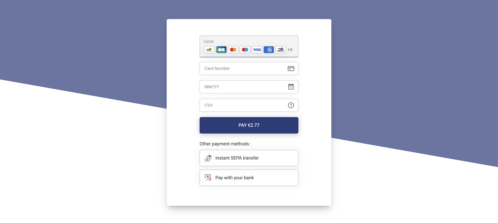

<!-- BACK TO TOP LINK -->
<a id="readme-top"></a>


<!-- PROJECT SHIELDS -->
<div align="center">

[![Build][build-shield]][build-url]
[![NPM][npm-shield]][npm-url]
[![Contributors][contributors-shield]][contributors-url]
[![Quality][quality-shield]][quality-url]
[![Downloads][downloads-shield]][downloads-url]
[![MIT License][license-shield]][license-url]

</div>

<!-- PROJECT LOGO -->
<br />
<div align="center" style="margin-bottom:30px;">
  <a href="https://github.com/lyra/embedded-form-glue">
    
  </a>

  <h3 align="center">Embedded Form Glue - JavaScript Library</h3>

  <p align="center">
    Integrate Lyra payment form into any web application.
    <br />
    <a href="https://docs.lyra.com/en/rest/V4.0/javascript/"><strong>Explore the docs »</strong></a>
    <br />
    <br />
    <a href="https://github.com/lyra/embedded-form-glue#getting-started">Quick Start</a>
    ·
    <a href="https://github.com/lyra/embedded-form-glue/issues">Report Bug</a>
    ·
    <a href="https://github.com/lyra/embedded-form-glue/issues">Request Feature</a>
  </p>
</div>




## About the project

Any payment form must comply with PCI-DSS requirements. A classical integration will be displayed
on the banks page using a redirection. In that case, PCI-DSS requirements are done by your bank.

By using this package Lyra allows to integrate a payment form using standard HTML elements on your 
website. This library will load the [Javacript library][doc-home] from Lyra servers transforming 
automatically each sensitive field (pan, security code, ...) into an IFrame, allowing to comply with 
all regulations.

The **embedded-form-glue** glue library provides a set of utilities to easily integrate the Payment 
form into any we application made with Javascript frameworks like React, Vue, Angular, Svelte, 
Ionic, etc.

## Getting Started

### Prerequisites

Install the current [node.js LTS version](https://nodejs.org/en/).

### Installation

To start using the package, just install it executing the following command:

```bash
npm install --save @lyracom/embedded-form-glue
```

## Usage

### Theme

First, define the theme files to load in the head section of your HTML page:

```html
<head>
  (...)
  <link rel="stylesheet" 
    href="~~CHANGE_ME_ENDPOINT~~/static/js/krypton-client/V4.0/ext/neon-reset.css">
  <script src="~~CHANGE_ME_ENDPOINT~~/static/js/krypton-client/V4.0/ext/neon.js"></script>
  (...)
</head>
```

> **Note**
> 
> Replace **`~~CHANGE_ME_ENDPOINT~~`** with your configuration endpoint.

For more information about theming, please see [Lyra theming documentation][doc-themes]

### DOM location

After that, define the location where the payment form will be generated in your HTML page:

```html
<div id="myPaymentForm">
  <div class="kr-smart-form"></div>
</div>
```

> **Note**
> 
> Specifify the element **kr-smart-form** inside the target location to load the Smart Form (any 
> kind of payment method).

### Javascript

Import the library in your javascript file or component with:

```javascript
import KRGlue from "@lyracom/embedded-form-glue";
```

And finally, you can generate the payment form with the following code:

```javascript
/* Integration public key */
const publicKey = '~~CHANGE_ME_PUBLIC_KEY~~';
/* Endpoint. Must include the protocol (https://) */
const endPoint = '~~CHANGE_ME_ENDPOINT~~'; 

/* Load the remote library and get the KR object */
const { KR } = await KRGlue.loadLibrary(endPoint, publicKey) 
/* Setting configuration */
await KR.setFormConfig({ 'kr-language': 'en-US' }))
/* Attach a payment form to a given DOM selector */
const { result } = await KR.attachForm('#myPaymentForm'))
/* Show the payment form */
await KR.showForm(result.formId));
```
> **Note**
> 
> Replace **`~~CHANGE_ME_PUBLIC_KEY~~`** with your configuration public key.
> 
> Replace **`~~CHANGE_ME_ENDPOINT~~`** with your configuration endpoint.

> **Warning**
> 
> KR methods use Promises. You should always use the **await** keyword or **then method** when 
> calling them. Please see [Javascript Promises][js-promises] and [Async Functions][js-async-await] 
> for more information.

## First transaction

Once the payment form is set up, you will see the skeleton animation. This is because the form is
using the default demo token. To make a real transaction, you need to get a real **formToken**.

To get a proper test **formToken**, make a request to the Charge/CreatePayment web service. To not
expose your credentials, it is mandatory to do that from a server. Please see the 
[NodeJS server example](examples/server/README.md), or visit the following links for more 
information:

- [Embedded form quick start][doc-quick-start]
- [embedded form integration guide][doc-integration-guide]
- [Payment REST API reference][doc-api-reference]

Once you have a **formToken**, you can set it in the payment form with the following code:

```javascript
await KR.setFormConfig({ formToken: '~~CHANGE_ME_FORM_TOKEN~~' })
```

> **Note**
>
> Replace **`~~CHANGE_ME_FORM_TOKEN~~`** with your form token.

After setting the real **formToken**, the payment form will be displayed with the available payment
methods.

## Methods

### loadLibrary

Use `loadLibrary` method to load the Lyra Javascript library. The method returns a `Promise` with 
the `KR` object.

```javascript
const { KR } = await KRGlue.loadLibrary(endPoint, publicKey) 
```

## KR object

The **KR** object is the main object of the library. It is used to manipulate the payment form.

The available methods and callbacks are described in the following sections.

- [KR methods](./docs/kr_methods.md)
- [KR callbacks](./docs/kr_callbacks.md)

> **Note**
> 
> See Lyra [Javascript library reference][doc-reference] for the complete reference guide.

## JavaScript frameworks integration

Please find integration examples for some of the main javascript frameworks in the following links:

| **Framework** | **Description**                                         |
| ------------- | ------------------------------------------------------- |
| vue.js        | [Vue options API example](examples/vue/options)         |
| react.js      | [React example](examples/react)                         |
| angular       | [Angular example](examples/angular)                     |
| svelte        | [Svelte example](examples/svelte)                       |
| next.js       | [Next.js example](examples/next)                        |
| ionic         | [Ionic example](examples/ionic)                         |
| vue.js        | [Vue composition API example](examples/vue/composition) |
| ember.js      | [Ember.js example](examples/ember)                      |

## Customization

The payment form can be customized in many ways. Some of them in the following examples:

- [Use a custom field order](./docs/customization#use-a-custom-field-order)
- [Add additional fields](./docs/customization#add-additional-fields)
- [Use a different HTML structure](./docs/customization#use-a-different-html-structure)

Any of these customizations can be done using the same method **KR.attachForm()**.

> **Note**
> 
> Please see the [Field Customization][doc-customization] section of the documentation for more 
> information.

<!-- CONTRIBUTING -->
## Contributing

Contributions are welcome and pull requests will be reviewed and taken into account.

### Installation

To compile the library please run the following commands:

```bash
npm install
npm run build
```

### Testing

To run the e2e tests, first build the examples with:

```bash
npm run examples:build
npm run examples:prepare
```

On a separated instance, initialize the servers with:

```bash
npm run examples:serve
```

Execute the tests with the command:

```bash
npm run test
```

<!-- LICENSE -->
## License

Distributed under the MIT License. See the [LICENSE file](./LICENCE.txt) for more information.

<p align="right">(<a href="#readme-top">back to top</a>)</p>

<!-- MARKDOWN LINKS & IMAGES -->
[build-shield]: https://img.shields.io/circleci/build/github/lyra/embedded-form-glue?style=for-the-badge&logo=github
[build-url]: https://circleci.com/gh/lyra/embedded-form-glue
[npm-shield]: https://img.shields.io/npm/v/@lyracom/embedded-form-glue?style=for-the-badge&logo=npm
[npm-url]: https://www.npmjs.com/package/@lyracom/embedded-form-glue
[contributors-shield]: https://img.shields.io/github/contributors/lyra/embedded-form-glue.svg?style=for-the-badge&logo=github
[contributors-url]: https://github.com/othneildrew/lyra/embedded-form-glue/graphs/contributors
[quality-shield]: https://img.shields.io/npms-io/quality-score/@lyracom/embedded-form-glue?style=for-the-badge&logo=npm
[quality-url]: https://npms.io/search?q=%40lyracom%2Fembedded-form-glue
[downloads-shield]: https://img.shields.io/npm/dm/@lyracom/embedded-form-glue?style=for-the-badge&logo=npm
[downloads-url]: https://www.npmjs.com/package/@lyracom/embedded-form-glue
[license-shield]: https://img.shields.io/github/license/lyra/embedded-form-glue.svg?style=for-the-badge&logo=github
[license-url]: https://github.com/lyra/embedded-form-glue/blob/master/LICENSE.txt

<!-- DOC LINKS -->
[doc-home]: https://docs.lyra.com/en/rest/V4.0/javascript/
[doc-quick-start]: https://docs.lyra.com/en/rest/V4.0/javascript/quick_start_js.html
[doc-reference]: https://docs.lyra.com/en/rest/V4.0/javascript/features/reference.html
[doc-themes]: https://docs.lyra.com/en/rest/V4.0/javascript/features/themes.html
[doc-integration-guide]: https://docs.lyra.com/en/rest/V4.0/javascript/guide/start.html
[doc-api-reference]: https://docs.lyra.com/en/rest/V4.0/api/reference.html
[doc-customization]: https://docs.lyra.com/en/rest/V4.0/javascript/features/custom_fields.html
[js-promises]: https://developer.mozilla.org/en-US/docs/Web/JavaScript/Guide/Using_promises
[js-async-await]: https://developer.mozilla.org/en-US/docs/Web/JavaScript/Reference/Statements/async_function