# KR object callbacks

These are the current available callbacks to manipulate the payment form:

## onError

Callback called when an error occurs: return a `promise` with the `KR` object.

```javascript
const { KR } = await KR.onError(error => {
  // Handle error
})
```

> **Note**
>
> Please see the [type definition](../index.d.ts) file for more information about the `error` object.

## onSubmit

Callback called when the payment form is submitted: return a `promise` with the `KR` object.

```javascript
const { KR } = await KR.onSubmit(paymentResponse => {
  // Handle result
})
```

> **Note**
>
> Please see the [type definition](../index.d.ts) file for more information about the `paymentResponse` object.

## onFormCreated

Callback called when the payment form DOM elements are created: return a `promise` with the `KR` object.

```javascript
const { KR } = await KR.onFormCreated(() => {
  // Handle result
})
```

Deprecated use **onFormReady**

## onLoaded

Callback called when the payment form application is loaded: return a `promise` with the `KR` object.

```javascript
const { KR } = await KR.onLoaded(() => {
  // Handle result
})
```

## onFormReady

Callback called when the payment form is ready to be submitted: return a `promise` with the `KR` object.

```javascript
const { KR } = await KR.onFormReady(() => {
  // Handle result
})
```

## onFocus

Callback called when a cards payment form field is focused: return a `promise` with the `KR` object.

```javascript
const { KR } = await KR.onFocus(field => {
  // Handle result
})
```

> **Note**
>
> Please see the [type definition](../index.d.ts) file for more information about the `field` object.

## onBlur

Callback called when a cards payment form field loses the focus: return a `promise` with the `KR` object.

```javascript
const { KR } = await KR.onBlur(field => {
  // Handle result
})
```

> **Note**
>
> Please see the [type definition](../index.d.ts) file for more information about the `field` object.

## onBrandChanged

Callback called when the brand of a cards payment form field changes: return a `promise` with the
`KR` object.

```javascript
const { KR } = await KR.onBrandChanged(({ KR, card }) => {
  // Handle result
})
```

> **Note**
>
> Please see the [type definition](../index.d.ts) file for more information about the `card` object.

## onTransactionCreated

Callback called when a transaction is created: return a `promise` with the `KR` object.

```javascript
const { KR } = await KR.onTransactionCreated(paymentResponse => {
  // Handle result
})
```

Deprecated use **onOrderUpdate**

> **Note**
>
> Please see the [type definition](../index.d.ts) file for more information about the `paymentResponse` object.

## on3dSecureAbort

Callback called when a 3D Secure authentication is aborted: return a `promise` with the `KR` object.

```javascript
const { KR } = await KR.on3dSecureAbort(() => {
  // Handle result
})
```

## onPopinClosed

Callback called when the payment form popin is closed: return a `promise` with the `KR` object.

```javascript
const { KR } = await KR.onPopinClosed(() => {
  // Handle result
})
```

## onInstallmentChanged

Callback called when the installment field value of a cards payment changes: return a `promise`
with the `KR` object.

```javascript
const { KR } = await KR.onInstallmentChanged(({ KR, installmentInfo }) => {
  // Handle result
})
```

> **Note**
>
> Please see the [type definition](../index.d.ts) file for more information about the
> `installmentInfo` object.

## onFormValid

Callback called when the payment form is valid: return a `promise` with the `KR` object.

```javascript
const { KR } = await KR.onFormValid(() => {
  // Handle result
})
```

## button.onClick

Callback called when the cards payment form button is submitted: return a `promise` with the
`KR` object.

```javascript
const { KR } = await KR.button.onClick(() => {
  // Handle result
})
```

## wallet.onTabChange

Callback called when the wallet payment form tab changes: return a `promise` with the `KR` object.

```javascript
const { KR } = await KR.wallet.onTabChange(tab => {
  // Handle result
})
```

## onOrderUpdate

The KR.onOrderUpdate method receives a callback as a parameter that will be called every time

- a transaction is created
- or cancelled (Ticket Restaurant)
- or refunded (Illicado)

It replaces the previously used onTransactionCreated method, which is now deprecated because refunded and cancelled transactions were not supported.

The method onOrderUpdate receives only one parameter, a callback function, and returns a successful promise if the callback is correctly set.

```javascript
KR.onOrderUpdate(callback)
```

Every time a transaction is created, cancelled, or refunded, the registered callback will be called with the complete server response.
For the processPayment call it looks like the following.

```javascript
{
  clientAnswer: ClientAnswer
  hash: string
  hashAlgorithm: string
  hashKey: string
  serverDate: string
  rawClientAnswer: string
  _type: string
  _name: 'payment' |
    'billingPartialPayment' |
    'partialPaymentCancelledOrRefunded'
}
```

Where:

| \_name                            | description                                                                            |
| --------------------------------- | -------------------------------------------------------------------------------------- |
| payment                           | Transaction created (Accepted or refused) with the full transaction import             |
| partialPaymentCancelledOrRefunded | Existing transaction has been cancelled, or a new refund transaction has been created. |
| billingPartialPayment             | Partial transaction created (Accepted or refused)                                      |

For the cancel of a partialPayment the response looks like:

```javascript
{
  clientAnswer: ClientAnswer
  hash: string
  hashAlgorithm: string
  hashKey: string
  type: 'V4/Charge/ProcessPaymentAnswer'
  _name: 'partialPaymentCancelledOrRefunded'
  _cancelledTransactionUuid: string
}
```

The callback set by the user may return false or a rejected promise if they want to stop the redirection after a payment is completed. In the case of a partial payment transaction, this return value will be ignored, as there is no redirection until the payment is wholly paid.

### Examples

**Example 1**
For example, if the merchant wants to do nothing on partial transactions but stop redirection if the payment is completed with a "CARDS" transaction:

```javascript
KR.onOrderUpdate(({ _name, clientAnswer }) => {
  // Partial payment, do nothing
  if (_name === 'billingPartialPayment') return

  const { detailedStatus, paymentMethodType } = clientAnswer.transactions[0]

  // The merchant want to stop the redirection to the page defined in kr-post-url-success
  // and manage buyer interaction himself
  if (detailedStatus === 'CAPTURED' && paymentMethodType === 'CARDS')
    return false
})
```

**Example detect a cancelled or refunded transaction**
To differentiate a cancelled transaction with a refunded transaction. The cancelled transaction will have transaction.detailedStatus === "CANCELLED". The refunded transaction will still have transaction.detailedStatus=== "CAPTURED", there will be another transaction in the transaction list with the refund transaction.

```javascript
KR.onOrderUpdate(({ clientAnswer, _name, _cancelledTransactionUuid }) => {
  if (_name === 'partialPaymentCancelledOrRefunded') {
    // transaction with uuid  _cancelledTransactionUuid  has been cancelled.
    // Let's log the cancelled amount
    const transaction = clientAnswer.transactions.find(
      t => t.uuid === _cancelledTransactionUuid
    )
    // in currencies with cents, the amount will be in cents
    console.log(
      `Transaction with amount ${transaction.amount} has been cancelled`
    )
  }
})
```

## smartForm.onClick

This method allows to add a callback that will intercept several click actions done by the user.

```javascript
KR.smartForm.onClick(({ paymentMethod, action, formId }) => {
  // Callback implementation
})
```

If the provided callback returns one of the following:

- FALSE
- A promise that eventually resolves to FALSE or returns
- A promise that eventually gets REJECTED

The normal execution will be stopped, any other returned value, even undefined will allow the application to work normally.

### Parameters

- paymentMethod: String containing the name of the selected payment method, it may contain
  - null (if the click is not payment method related)
  - A payment method ID from this list (see openPaymentMethod list)
  - 'WALLET\_' + the id of a payment method that supports wallet (i.e. CARDS or PAYPAL)
  - 'GROUP\_' + the name of a payment method group (i.e. CASHLATAM )
- action:
  - "beforePaymentStart" if it would start the payment process
  - "openPopin" if it just opens a modal that expects another user interaction within our library.
  - "methodSelected" with single payment button mode if a method is selected
- formId: The associated form ID or null if its not a cardForm related click

### Interception cases

| source                                              | image                                                   | paymentMethod   | action             | formId                                                                                                                                                                                                            |
| --------------------------------------------------- | ------------------------------------------------------- | --------------- | ------------------ | ----------------------------------------------------------------------------------------------------------------------------------------------------------------------------------------------------------------- |
| SmartForm pop-in button                             |           | null            | openPopin          | null                                                                                                                                                                                                              |
| Cards method option                                 | 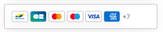    | CARDS           | openPopin          | null                                                                                                                                                                                                              |
| Any other payment method option                     | 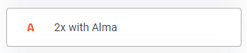           | ALMA_2X         | beforePaymentStart | null                                                                                                                                                                                                              |
| Card form payment button                            | 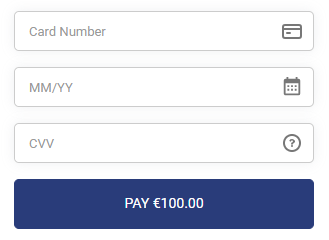             | CARDS           | beforePaymentStart | The ID of the associated form. May be used for cases where multiple forms exist. To separate, for example, the expanded card form button click from the different form inside the modal used by the wallet cards. |
| Payment method group                                | 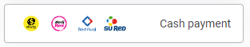   | GROUP_CASHLATAM | openPopin          | null                                                                                                                                                                                                              |
| Customer wallet (CARDS)                             | 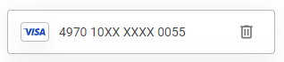   | WALLET_CARDS    | openPopin          | null                                                                                                                                                                                                              |
| Customer wallet (Other methods)                     | 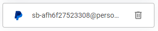 | WALLET_PAYPAL   | beforePaymentStart | null                                                                                                                                                                                                              |
| Single payment button (CARDS)                       | 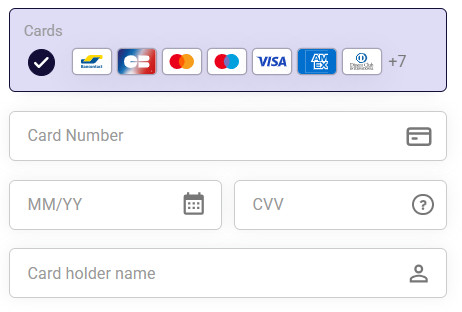             | CARDS           | methodSelected     | null                                                                                                                                                                                                              |
| Single payment button (Other payment method)        | 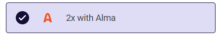              | ALMA_2X         | methodSelected     | null                                                                                                                                                                                                              |
| Single payment button (Card WALLET)                 | 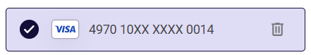        | WALLET_CARDS    | methodSelected     | null                                                                                                                                                                                                              |
| Single payment button (Other payment method WALLET) | 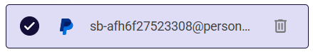      | WALLET_PAYPAL   | methodSelected     | null                                                                                                                                                                                                              |
|                                                     |                                                         |                 |                    |                                                                                                                                                                                                                   |

**Warnings**

- Single Payment Button mode. When the single payment button mode is enabled, the beforePaymentStart and openPopin actions will be triggered when clicking our payment button (the action will depend on the selected payment method) If a merchant uses a custom button they will have to manually manage the click event, as we will not trigger any events when clicking their custom element
- Default Payment Button mode. In default payment button mode, clicking on an embedded method's button to open or close it will not invoke the smartForm.onClick callback

### Examples

**Example 1**
The following callback implementation will block all the user interactions listed above if a hypothetical "accept terms and conditions" checkbox has not been selected.

```javascript
KR.smartForm.onClick(({ paymentMethod, action, formId }) => {
  // Check if terms and conditions has been accepted
  return document.querySelector('input.terms-and-conditions-checkbox').checked
})
```

**Example 2**
The following callback implementation will block all the attempts to start a payment but will allow the user to open the popin / groups / wallet

```javascript
KR.smartForm.onClick(({ paymentMethod, action, formId }) => {
  return action === 'openPopin'
})
```

**Example 3**
The following callback implementation will stop only payments done by card

```javascript
KR.smartForm.onClick(({ paymentMethod, action, formId }) => {
  return !(paymentMethod === 'CARDS' && action === 'beforePaymentStart')
})
```

## wallet.onTokenPaymentDeleted

In wallet mode some payment method details are saved on the server.
This enables the user to pay without entering all the details each time.
At that time the supported payment methods are: CARDS, PAYPAL.
The user can delete a payment method using the garbage icon.

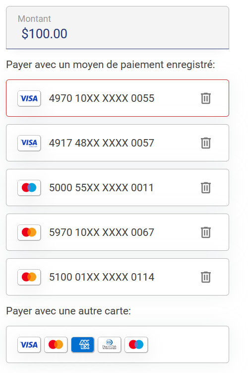

It is possible to add a callback to be executed when a wallet payment information (token) is deleted.

```javascript
KR.wallet.onPaymentTokenDeleted(callback)
```

The call returns a successful promise if the callback is correctly set.
Parameter passed to the callback if the delete payment token was from the CARDS payment method:

```typescript
{
  token: string
  fields: {
    partialPan: string
    expiryDate: string
  }
}
```

Parameter passed to the callback if the delete payment token was from the PAYPAL payment method:

```typescript
{
  token: string
  email: string
}
```

### Examples

```javascript
KR.wallet.onPaymentTokenDeleted(console.log) >
  // After a CARDS payment token is deleted the result on the console will be something like
  {
    token: 'ey200hefeho44djofhyefbsaqs',
    fields: { partialPan: '497010XXXXX0001', expiryDate: '12/2025' },
    paymentMethod: 'CARDS'
  }
```
