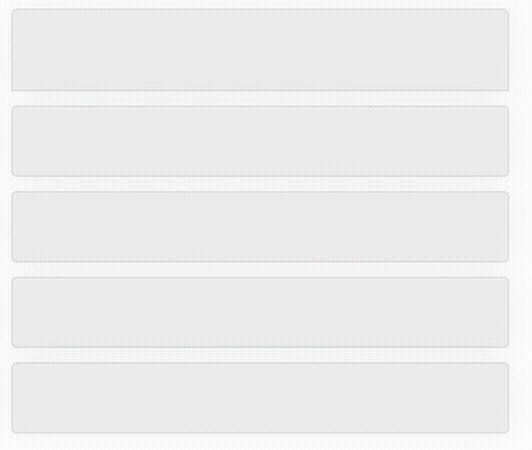
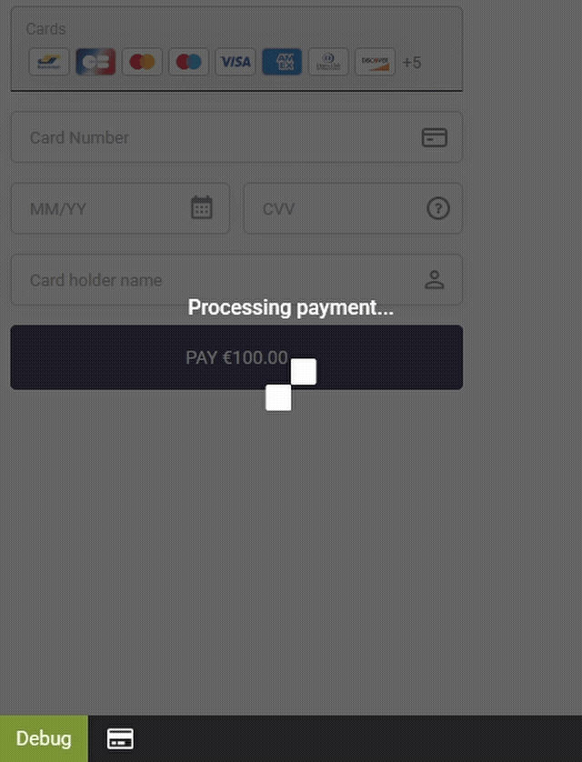

# KR object methods

These are the current available methods to manipulate the payment form:

## renderElements

Render a payment form into a given DOM selector: return a `promise` with the `KR` object and result.

```javascript
const selector = `#myPaymentForm` // DOM selector
const { KR, result } = await KR.renderElements(selector)
```

> **_NOTE:_** if nothing is provided renderElements will search the complete DOM for the supported HTML elements

## attachForm (DEPRECATED use renderElements instead)

Attach a payment form to a given DOM selector: return a `promise` with the `KR` object and result.

```javascript
const selector = `#myPaymentForm` // DOM selector
const { KR, result } = await KR.attachForm(selector)
```

## addForm

Add a payment form to a given DOM selector: return a `promise` with the `KR` object and result.

```javascript
const selector = `#myPaymentForm` // DOM selector
const { KR, result } = await KR.addForm(selector)
```

> **Warning**
>
> Only for cards payment method

## showForm

Display a generated payment form: return a `promise` with the `KR` object.

```javascript
const { result } = await KR.addForm(selector)
const { KR } = await KR.showForm(result.formId)
```

## hideForm

Hide a generated payment form: return a `promise` with the `KR` object.

```javascript
const { result } = await KR.addForm(selector)
const { KR } = await KR.hideForm(result.formId)
```

## setFormConfig

Set the configuration of the payment form on runtime: return a `promise` with the `KR` object.

```javascript
const { KR } = await KR.setFormConfig({
  formToken: `DEMO-TOKEN-TO-BE-REPLACED`,
  language: `en-US`
})
```

> **Note**
>
> Please see the [type definition](../index.d.ts) file for the list of available configuration options.

## validateForm

Validate the payment form: return a `promise` with the `KR` object and validation result.

```javascript
const { KR, result } = await KR.validateForm()
if (result.error) {
  // Handle error
} else {
  // Handle success
}
```

## submit

Submit the payment form: return a `promise` with the `KR` object.

```javascript
const { KR } = await KR.submit()
```

## openPaymentMethod

Open the given payment method: return a `promise` with the `KR` object. The payment method must be
available in the payment form.

```javascript
const { KR } = await KR.openPaymentMethod('cards')
```

## openPopin

On popin mode, open the payment form in a popin: return a `promise` with the `KR` object.

```javascript
const { KR } = await KR.openPopin()
```

## closePopin

On popin mode, close the payment form in a popin: return a `promise` with the `KR` object.

```javascript
const { KR } = await KR.closePopin()
```

## button.setLabel

Sets the label of the submit button: return a `promise` with the `KR` object.

```javascript
const { KR } = await KR.button.setLabel('Pay now')
```

## button.enable

Enable the submit button: return a `promise` with the `KR` object.

```javascript
const { KR } = await KR.button.enable()
```

## button.disable

Disable the submit button: returns a `promise` with the `KR` object.

```javascript
const { KR } = await KR.button.disable()
```

## button.hide

Hide the submit button: returns a `promise` with the `KR` object.

```javascript
const { KR } = await KR.button.hide()
```

## button.show

Show the submit button: returns a `promise` with the `KR` object.

```javascript
const { KR } = await KR.button.show()
```

## button.showSpinner

Show the loading spinner on the submit button: return a `promise` with the `KR` object.

```javascript
const { KR } = await KR.button.showSpinner()
```

## button.hideSpinner

Hide the loading spinner on the submit button: return a `promise` with the `KR` object.

```javascript
const { KR } = await KR.button.hideSpinner()
```

## setBrand

Set a brand on the cards payment form: return a `promise` with the `KR` object.

```javascript
const { KR } = await KR.setBrand('visa')
```

## removeForms

Remove all generated payment forms: return a `promise` with the `KR` object.

```javascript
const { KR } = await KR.removeForms()
```

## removeEventCallbacks

Remove all event callbacks: return a `promise` with the `KR` object.

```javascript
const { KR } = await KR.removeEventCallbacks()
```

## setHelpVisibility

Enables the user to hide or show the help info buttons from the card form (cvv field and pan field when the card is cobranded). The parameters are the **formId** (returned by renderElements) and a boolean. You can pass undefined for the formId and the change will apply to all forms. By default the help info buttons are visible.

```javascript
const { KR } = await KR.setHelpVisibility(formId, false)
```

## fields.pan.help.button

It's possible to hide/show the help button from the pan field that appears when a cobranded card is entered. By using these methods instead of setHelpVisibility you can target only the help button from the pan field and the other from the cvv field will not be affected.

```javascript
KR.fields.pan.help.button.show()
KR.fields.pan.help.button.hide()
KR.fields.pan.help.button.restoreDefaultVisibility()
```

## fields.cvv.hide & fields.cvv.show

It's possible to hide/show the **content** of the cvv input. If the content is hidden there will be some bullet points instead of the numbers.

```javascript
KR.fields.cvv.hide()
KR.fields.cvv.show()
```

## fields.focus

It's possible to focus a field from the cardForm. The function takes one parameter the class of the field to focus.
It returns a succesful Promise if the field exists and is focusable.
The parameter can be:

```typescript
type param =
  | 'kr-pan'
  | 'kr-expiry'
  | 'kr-security-code'
  | 'kr-identity-document-type'
  | 'kr-installment-number'
  | 'kr-first-installment-delay'
  | 'kr-do-register'
  | 'kr-identity-document-number'
  | 'kr-card-holder-name'
  | 'kr-card-holder-mail'
```

**Example**

```javascript
KR.fields.focus('kr-do-register')
```

## getPaymentMethods

This method will return an object with the available payment methods and card brands.

```typescript
KR.getPaymentMethods: () => Promise<PaymentMethodObj>

interface PaymentMethodObj = {
    paymentMethods: string[],
    cardBrands: string[]
}

const methods = await KR.getPaymentMethods()
console.log(methods)
```

## throwCustomError

This method allows a merchant to manually throw an error that will be displayed in the form.

```typescript
KR.smartForm.throwCustomError(errorMessage, paymentMethod)

KR.throwCustomError('My custom error message', 'GOOGLEPAY')
KR.throwCustomError('My custom error message', 'IP_WIRE')
KR.throwCustomError('My custom error message', 'CARDS')
KR.throwCustomError('My custom error message')
```

Parameters:

- errorMessage: String containing the message that will be displayed.
- paymentMethod: String containing the payment method that triggered the error
  This parameter will define where the error message is displayed inside the application
  If not specified the error will appear in the default position (under the smartform method list)
  If provided a specific payment method, the error will display as if the specified payment method was the one triggering the error (depending on the used configuration the position will change. i.e. the error will appear below the smartbutton if present or appear differently if the card form is expanded).

## Skeleton

It is now possible to force the visibility of the skeleton in all widgets using two methods: KR.skeleton.show() and KR.skeleton.hide(). These methods override the default behavior and provide developers with full control over the skeleton's visibility.



```typescript
KR.skeleton.show()
```

- Forces the skeleton to become visible for all widgets.
- The call is synchronous and returns a successful promise.

```typescript
KR.skeleton.hide()
```

- Forces the skeleton to become hidden for all widgets.
- The call is synchronous and returns a successful promise.

## Overlay

It is possible to force the visibillity of the loading overlay using 2 methods: KR.overlay.show() and KR.overlay.hide(). These methods override the default behavior. To restore default behavior there is the KR.overlay.restoreDefaultVisibility() method.

```typescript
KR.overlay.show()
KR.overlay.hide()
KR.overlay.restoreDefaultVisibility()
```


